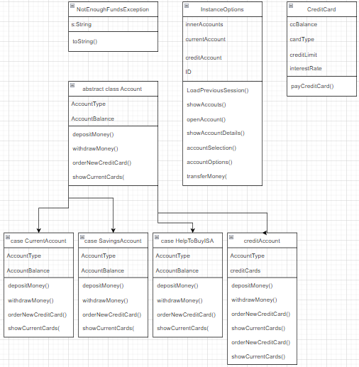

Banking Project
--------------------------------------------------------------
The goal of this project was to create a basic banking system, with extensive functionality, whilst attempting to cover as many as the Scala training topics as possible. 

Current Structure 
--------------------------------------------------------------

Functionality provided
--------------------------------------------------------------
- Create an account with a unique username and password, a unique ID is provided automatically
- Account credentials and class states are saved to an external CSV upon program exit
- Login to an existing account and load the state of your account from previous sessions automatically
- Each customer account is automatically loaded with a Current account
- New accounts can be added including: Savings account, Help to buy ISA, Credit Account
- Customers have the ability to display account information, either indivdually, or their entire portfolio
- Credit Accounts have the ability to apply for new credit cards, each with their own individual traits
- Customers can display their credit card portfolio for complete transparency 
- Funds can be deposited to a selected accounts 
- Funds can be withdrawn from selected accounts (Includes exception handling for withdrawing too many funds)
- Funds can be transfered from one account to another

Scala Topics Covered
--------------------------------------------------------------
- Basic Classes: InstanceOption Class, CreditCardClass
- Abstract Classes: Account
- Case classes: CurrentAccount, SavingsAccount, HelpToBuyISA 
- Inheritance: CreditAccount
- Field overriding
- Method overriding
- Custom Exceptions: NotEnoughFundsException
- Try, Catch blocks for excepton handling
- Pattern matching 
- More Control structures: for loops, do while loops, forEach loops
- Using dependencies (Custom CSV dependency acquired from GitHub)
- Print formatting (\n, printf, println($))
- A plethora of functions
- User inputs / console interaction
- String manipulation (.substring, .split, .concat)
- Collections framework (ArrayBuffers, ListBuffers and their counterparts)
- Various numerical operations
- Access modifiers
- throws keyword

Improvements to be made
--------------------------------------------------------------
