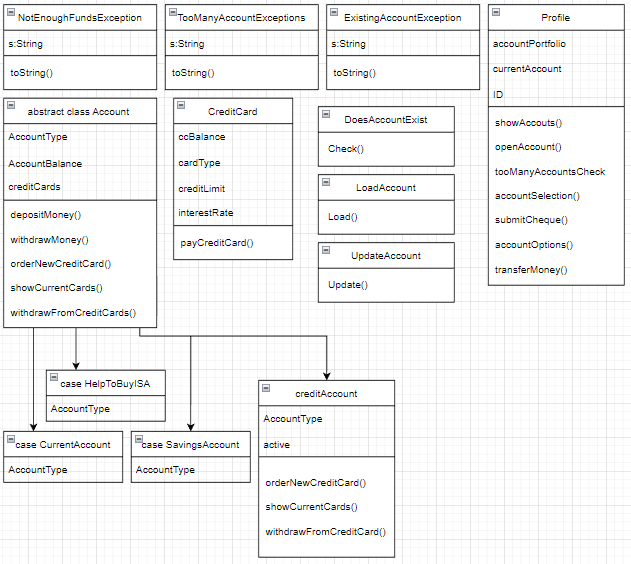

Banking Project
--------------------------------------------------------------
The goal of this project was to create a basic banking system, with extensive functionality, whilst attempting to cover as many as the Scala training topics as possible. 

Prerequisites Required Before Running
--------------------------------------------------------------
- An active mySQL server must be installed and running on the local machine before attempting to run the program
- All three classes inside the SQL_Account_Storage directory must be updated so that the username and passwords match the credentials of your mySQL connection. Please see the TODO lines on each of the classes
- A new accountStorage table must be created inside an accountStorage database with the correct field names. Copy and paste the text file inside SQL_Account_Storage into your mySQL workbench to do this.

How To Run
--------------------------------------------------------------
- Program starts from the login object, please run from here
- Ensure that you safe exit using the corresponding menu options, terminating the program via Intellij will cause any account updates not to be saved to mySQL
- Always ensure that the corresponding number keys are used to navigate all menus unless indicated otherwise

Simplified Class Hierarchy 
--------------------------------------------------------------

Project Structure
--------------------------------------------------------------

Functionality provided
--------------------------------------------------------------
- Create an account with a unique username and password, a unique ID is provided automatically
- Account credentials and class states are saved to an external CSV upon program exit
- Login to an existing account and load the state of your account from previous sessions automatically
- Each customer account is automatically loaded with a Current account
- New accounts can be added including: Savings account, Help to buy ISA, Credit Account
- Customers have the ability to display account information, either indivdually, or their entire portfolio
- Credit Accounts have the ability to apply for new credit cards, each with their own individual traits
- Customers can display their credit card portfolio for complete transparency 
- Funds can be deposited to a selected accounts 
- Funds can be withdrawn from selected accounts (Includes exception handling for withdrawing too many funds)
- Funds can be transfered from one account to another
NOTE all code has been commented with a brief statement regarding it's use case in the program

Scala Topics Covered
--------------------------------------------------------------
- Basic Classes: InstanceOption Class, CreditCardClass
- Abstract Classes: Account
- Case classes: CurrentAccount, SavingsAccount, HelpToBuyISA 
- Inheritance: CreditAccount
- Field overriding
- Method overriding
- Custom Exceptions: NotEnoughFundsException
- Try, Catch blocks for excepton handling
- Pattern matching 
- More Control structures: for loops, do while loops, forEach loops
- Using dependencies (Custom CSV dependency acquired from GitHub)
- Print formatting (\n, printf, println($))
- A plethora of functions
- User inputs / console interaction
- String manipulation (.substring, .split, .concat)
- Collections framework (ArrayBuffers, ListBuffers and their counterparts)
- Various numerical operations
- Access modifiers
- throws keyword

Improvements to be made
--------------------------------------------------------------
- Complete the payCreditCard function inside CreditCard class
- Currently, the program is extremely breakable. Every stage needs use validation, and can easily be broken with the incorrect input
- User actions need to be validated for more security, currently the user can deposit however much money they want with no proof
- Users can open multiple accounts of the same type, this should not be possible and needs to be addressed (This is also the same for credit cards)
- Some code is very inefficient and need optimization. This makes for an underwhelming time complexity for most tasks
- Account saving is fairly buggy and needs optimization (Multiple same name accounts can be created, unused accounts are not deleted from the CSV when reinstansiated, etc)
- Classes and bunched together inside the same .scala script, they need to be seperated out for more readability
